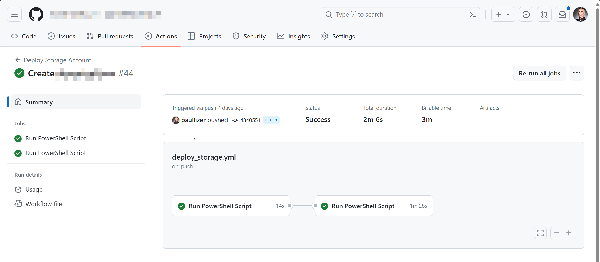

<!-- announcement-start -->
<!-- announcement-end -->

# Enterprise-Scale IAC and CI/CD

> [!NOTE]
>
> Work in Progress. 

Tailored for large-scale operations, Enterprise-Scale IaC and CI/CD provides advanced tutorials, strategies, and practices for robust cloud infrastructure management using GitHub Actions.

### Table of Contents

1. [Overview](#Overview)
2. [Why](#Why)
3. [How to use](#how-to-use)
4. [Implementation](#Implementation)
5. [Enhancing Deployment Governance through Pull Requests](#enhancing-deployment-governance-through-pull-requests)
6. [Example Scenarios](#example-scenarios)

## Overview

Words

## Why

Words

## How to Use

Words

## Implementation

### Registered Application

### Permissions

## Enhancing Deployment Governance through Pull Requests

Achieving enterprise scale involves more than just the ability to deploy dozens or hundreds of resources efficiently through the creation of new parameter JSON files. While such a mechanism significantly streamlines the creation of new resources, the overarching operational management—particularly the review and approval process of these files—becomes crucial as the organization grows.

Initially, teams utilizing this repository might opt to deploy new parameter JSON files directly to the main branch. This approach might suffice for some, offering simplicity and speed. However, as operations scale and complexities increase, the limitations and potential risks of direct deployment become apparent.

## Methodologies

#### Deploying Directly to the Main Branch

**Pros:**

- Straightforward process.
- Expedited deployments.
- Familiar workflow for many teams.

**Cons:**

- Limited oversight with typically a single reviewer, increasing the risk of errors.
- Immediate effectuation of code changes to Azure, leaving narrow margins for error correction.

#### Deploying Using Pull Requests from Forked Branches

**Pros:**

- Mandatory code reviews enforce quality checks.
- Inherent delay offers a window for necessary code modifications.
- Changes to Azure configurations and user permissions are meticulously tracked, enhancing auditability and accountability.
- Promotes a culture of collaboration and continuous improvement among team members.

**Cons:**

- Increased lead time for deployments, contrasting with the direct-to-main approach's immediacy.

This evolved approach underscores the importance of **balancing agility with risk management**. By incorporating pull requests from forked branches into the deployment workflow, organizations can significantly mitigate the risks associated with direct deployments. This method not only fosters a more thorough review process but also enhances the traceability of changes, a critical aspect of managing complex cloud environments.

Moreover, the pull request model promotes a culture of collaboration and collective responsibility. It encourages teams to engage in constructive dialogues about code quality, architecture decisions, and operational best practices, leading to more resilient and well-thought-out deployments.

Transitioning to a governance model that prioritizes pull requests for deploying changes might require a cultural shift and adaptation of existing processes. However, the long-term benefits—improved code quality, enhanced security posture, and greater operational transparency—far outweigh the initial hurdles.

In essence, by embracing this shift, organizations are not just scaling their operations; they're elevating their deployment practices to align with best practices in software development and cloud governance. This strategic move is indispensable for organizations aiming to achieve sustainable growth and operational excellence in their cloud journey.

## Implement Using Pull Requests from Forked Branches

Describe here, show examples

Create Video of the workflow

## Example Scenarios

### Storage Account

